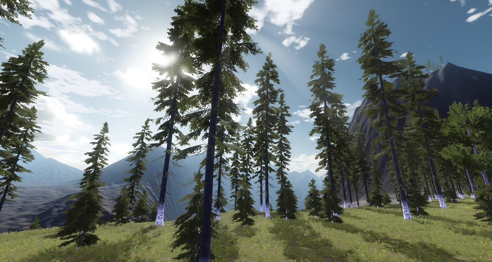

Terrain Module for Godot Engine 3.5
---------------------------------

Assets by [Roope](https://github.com/outobugi)

River Surface made using the [Waterway Plugin](https://github.com/Arnklit/Waterways) by Arnklit 

### Source code and export templates at [Gumroad](https://ozzrc.gumroad.com/l/qbcek)

To start testing, download or clone this repo [grab the compiled engine in the release section](https://github.com/ozzr/godot_terrain/tags) and open one of the projects.

## Description
Terrain system that works with the GLES3 and GLES2 renderers.

### What you get:
* Full In Editor terrain editor
* Endless Patched terrain
* Complex Biomes Rendering
* AND THE BEST: It works under GLES2 the same way as it does under GLES3 so you can target low end devices ( that was my most important objective all the time )
* More to come ...

### Where are the export templates?
I am releasing the editor for free. The export templates and the source code are available for purchase at [Gumroad](https://ozzrc.gumroad.com/l/qbcek) however my advice is that you compile the module your self, doing that is easier than you think, even if you are not a programmer, just do EXACTLY what the godot build pages tell to do. Depending on your machine, it could only take you some minutes to compile the engine.

### Where are the Tutorials?
[00 - Godot Engine Custom Terrain Module - Introduction](https://youtu.be/CWlr1-4R5fY)

[01 - Godot Engine Custom Terrain Module - The First Terrain](https://youtu.be/Sn48tMgi2_M)

[02 - Godot Engine Custom Terrain Module - The Terrain Node Properties](https://youtu.be/CWlr1-4R5fY)

**[Read The Documentation Here](https://github.com/ozzr/godot_terrain/blob/main/documentation/index.md)**

### Where can I report Issues?
Use this Page. 

### In what platforms does it work?
* [X] Windows - TESTED
* [X] Android - TESTED
* [X] Linux - TESTED
* [X] HTML5 - TESTED
* [ ] Mac - SHOULD WORK - CANT TEST PERSONALLY ON THIS PLATFORM
* [ ] iOs - SHOULD WORK - CANT TEST PERSONALLY ON THIS PLATFORM
* [ ] Any Other Platform - SHOULD WORK - The module is made entirely of Godot internal classes and resources so in theory it should work wherever Godot does.

# Important!
I am releasing the editor sooner so you can enjoy, or test, I still have some utilities to add and methods to expose to gdscript. Also, you should notice that terrain rendering is not a cheap task, so, target your low end devices wisely.

### Getting Started:
1. Add a Terrain Node into the Scene
2. Save the TerrainData as a separate File (is in the Storage group)
3. Go to the Terrain Menu (it is the Terrain Icon in the top left of the new side bar that appeared in your Spatial Vieport View) and Hit "Bake Globalmap"
4. Decide beforehand what sizes do you want for the textures. Downscaling is fine but when upscaling you get artifacts in the textures and the borders will no longer match. Use with care.
5. The new tool bar has a lot of buttons, hover them to know what they do. At the bottom of the column there are popup buttons: Brush Selector (B), Color Selector (C), Paint Texture Selecttor (T), Biome Selector (I), Simulation Selector (R). Test each one of them.
6. Good luck! I will release a Tutorial Video Soon

## ROADMAP
#### Stage 0
* [X] Add SmartTexture class (I love this class is everywhere in the module)
* [X] Add TerrainRenderer abstract class
  * Add Subrenderers:
    * [X] CDLODRendrerer
* [X] Add Erosion Simulation and Filters
  * [X] Hydraulic Erosion
  * [X] Thermal Erosion
  * [X] Wind Erosion
  * [X] Gaussian Blur Filter
* [X] Add Biomes
  * [X] Add PoissonGenerator and PoissonMixer classes for "pretty" entity placement
  * [X] Add BiomeItem types: DECAL, GRASS, SHRUB, OBJECT, TREE
* [X] Add BiomeRenderer abstract class
  * Add Subrenderers:
    * [X] GridRendrerer
* [X] Overhaul TerrainEditor class
  * [X] Add capability to export the images stored inside the Terrain Data to the file system with acustom .import attatched (Use it before releasing the game. The Terraindata class is really heavy in size and can and will slow down your load times)  
#### Stage 1
* [X] Add a Terrain Material class ( used by the BiomeItems to access each patch texture independently)
* [X] Add Biome Blocker Node
* [X] Add Surface Editor Node ( To edit the shadows heightmap and block biomes with custom meshes
* [X] Write Documentation
* [X] Release Initial Tutorials

#### Stage 2
* [ ] Add Surface Regional Texture Proxy ( Just something to read more than one patch texture as one) (Maybe use a viewport?) 
* [X] Add Navigation
* [ ] Add Path Painter
  * [ ] Add Roads
  * [ ] Add Rivers
* [ ] Update Documentation
